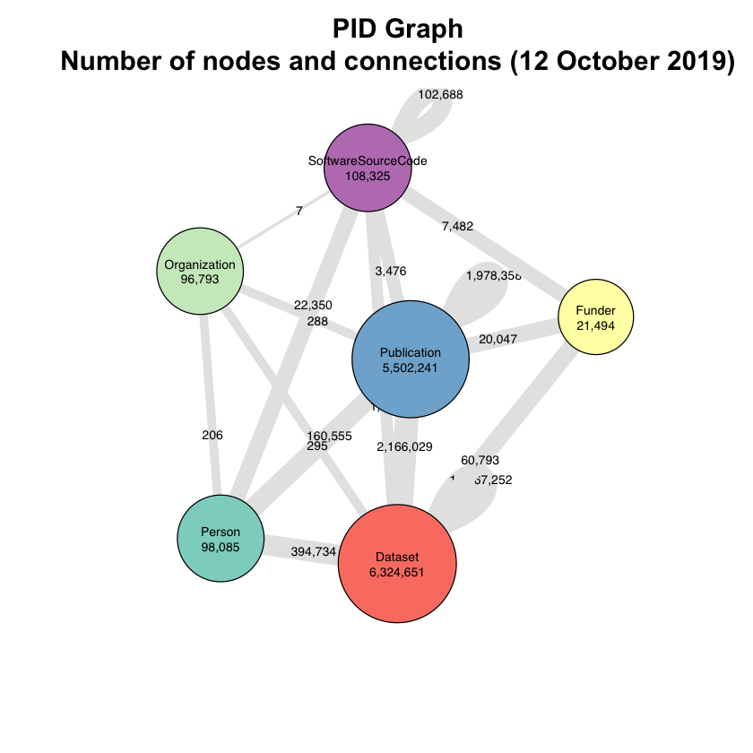

## PID Graph Key Performance Indicators (KPIs)

This Jupyter notebook uses the [DataCite GraphQL API](https://api.datacite.org/graphql) to fetch summary statistics about nodes and connections in it.

## License

[MIT](https://github.com/datacite/notebooks/blob/master/LICENSE)
