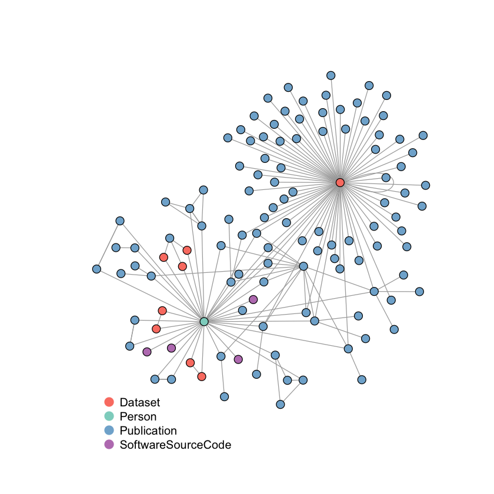

## Publications, datasets, and software by a particular researcher

This Jupyter notebook uses the [DataCite GraphQL API](https://api.datacite.org/graphql) to fetch all DataCite references of the DataCite publications, datasets and software authored by a particular researcher, using his/her ORCID ID.

## License

[MIT](https://github.com/datacite/notebooks/blob/master/LICENSE)
